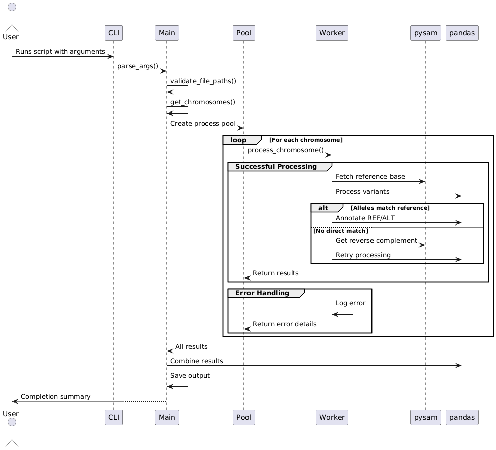

# 1. `pre-processing.sh`

This script will remove column GRCh37, switch column order, add `chr` and `rs` prefixes to values in subsequent columns, filter chr23 (chrX) positions and create a file `FP_SNPs_10k_GB38_twoAllelsFormat.tsv` in directory `data`


**Running**

```
bash pre-processing.sh
```

# 2. `main.py`

## Overview

A parallel processing script that converts output of script `pre-processing.sh` from #CHROM POS ID allele1 allele2 format to standard #CHROM POS ID REF ALT format using reference genome data. Processes chromosomes in parallel for efficient large-scale variant annotation.


## Key Features

- Parallel Processing: Utilizes multiprocessing for chromosome-wise parallel execution

- Input Validation: Checks file formats, headers, and permissions

- Comprehensive Logging: Console and file logging with rotation (5MB files, 3 backups)

- Flexible Configuration: Adjustable logging levels, process count, and validation options

- Error Handling: Detailed error reporting with chromosome-specific diagnostics

## Running

```
python main.py -i input.tsv -o annotated.vcf -d /path/to/references/
```

## Arguments


| Argument         | Description                                                       |
|------------------|-------------------------------------------------------------------|
| `-i/--input`     | Input TSV file (required)                                        |
| `-o/--output`    | Output VCF/TSV file (required)                                   |
| `-d/--ref-dir`   | Directory with reference genomes (required)                      |
| `-p/--processes` | Number of parallel processes (default: CPU count)                |
| `--log-file`     | Log file path (default: `./logs/annotation.log`)                 |
| `--log-level`    | Console log level (`DEBUG`, `INFO`, `WARNING`, `ERROR`, `CRITICAL`) |
| `--validate-only`| Validate input without processing                                |

## Requirements

Python 3.9+
Dependencies: pysam, pandas
Reference genome files in ref_dir (chr1.fa, chr2.fa, etc. with .fai indexes)


## Output

Generates a TSV/VCF file with variants annotated as:

```
#CHROM  POS     ID      REF     ALT
chr1    1000    rs123   A       T
```

## Logging Example

```
2023-11-15 14:30:00 - main - INFO - Starting parallel variant annotation
2023-11-15 14:30:01 - chr1 - INFO - Processing chr1: 500/1000 variants (50.0%)
2023-11-15 14:30:45 - main - INFO - Processing complete
```

